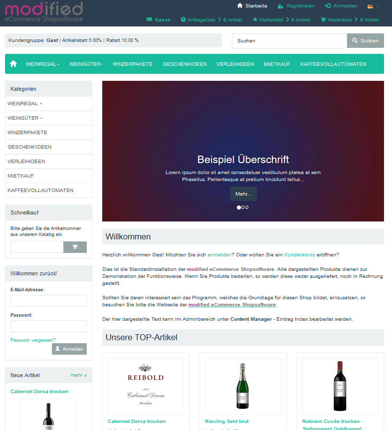

# Bootstrap3 für Modified Shop 2.0 - freies responsive Template

Das Template basiert auf dem Bootstrap-Framework 3 und wurde zuletzt angepasst und getestet mit der **Modified Shopversion 2.0.5.1**.

## Eigenschaften:
- responsive Template für PC, Tablet, Smartphone
- unterstützt alle Neuerungen der Shopversion 2.0 (z.B. Komprimierung, Filter).
- EU-Cookie-Hinweis - **jetzt mit Vorbereitung für das MODUL: OIL.js Cookie Consent Management (Anleitung im Anhang)**
- Bilderslider auf der Startseite
- Slider im Banner-Manager befüllbar
- Cloud-Zoom-Vergrößerung in der Produktdetailansicht
- verschiedene Themes können ausgewählt werden
- zentrales Dropdownmenü für alle Artikel
- bestimmte Kategorien können als Megamenü dargestellt werden
- zwei responsive Menüs für schmale Bildschirme (Smartphone, Tablet) wählbar
- Produktdetailansicht auf volle Breite einstellbar
- keine Core-Änderungen nötig
- in der Datei templates/bootstrap3/config/config.php können viele Einstellungen vorgenommen werden
- umbenennen durch Änderung des Ordnernamens

## Installation

- Vor jeder Änderung sollte ein Backup gemacht werden!
- Die Dateien aus dem Ordner **shoproot/** in den Shop kopieren.
- Im Adminbereich **Konfiguration -> Mein Shop** das Template auswählen.

## Bilderslider

Damit man sehen kann wie man den Banner Manager befüllen kann, ist im Paket ein Ordner „sliderbeispiele“ enthalten.

- Die Dateien aus dem Ordner in den Shop kopieren (evtl. muss der Name des Admin-Ordners vorher angepasst werden).
- Anschließend im Adminbereich unter **Module->System Module** das Modul **SLIDER-Beispiele für Template Bootstrap3** installieren. 
Dadurch wird der Banner Manger mit Musterdaten (deutsch und englisch) für den Slider befüllt.

*Die Installationsdatei admin/includes/modules/system/aa_slider_installer_system.php löscht sich normalerweise automatisch.*

## Themeänderungen
Sass- und Less-Dateien sind bei bootswatch.com zu finden - bitte bei "Tuned for ..." auf die Bootstrapversion 3.4.1 achten.
Eine PDF-Anleitung befindet sich im Ordner "anleitung_less/".

  

### Sollten Sie mit einem Problem nicht weiter kommen, finden sich bestimmt Helfer im Modified-Forum

### [Thema: TEMPLATE: Bootstrap3 für Shop 2.0 - freies responsive Template](https://www.modified-shop.org/forum/index.php?topic=37218.0)

  

Viel Spaß! 
Karl 

## Anhang

### Einbau - MODUL: OIL.js Cookie Consent Management

Wer das neue Modul bereits nutzen will, der muss darauf achten, von hier

[Thema: MODUL: OIL.js Cookie Consent Management](https://www.modified-shop.org/forum/index.php?topic=41168.0)

immer die aktuellen Dateien zu nutzen.

Ist das Modul aktualisiert worden, dann müssen auch diese Templatedateien geprüft werden
- templates/bootstrap4/boxes/box_content.html
- templates/bootstrap4/css/jquery.cookieconsent-oil.css
- templates/bootstrap4/javascript/general.js.php
- templates/bootstrap4/javascript/oil.min.js
- templates/bootstrap4/javascript/extra/cookieconsent.js.php
- templates/bootstrap4/index.html
- templates/bootstrap4/offline.html

#### Einbau

1.	Dateien aus den Ordnern NEW_FILES und CHANGED_FILES in den Shop kopieren.
2.	Im Adminbereich **Module -> System Module** das Modul **Cookie Consent** installieren.
3.	Konfiguriert kann das Modul unter Menüpunkt **Konfiguration -> Cookie Consent** werden.
	*Am Template müssen keine Veränderungen vorgenommen werden, alle nötigen Dateien sind im Templateordner enthalten.*

P.S.:
- Bei einem Update der Dateien aus dem oberen Link sollte man vorsichtshalber immer **Module -> System Module** einmal aufrufen. Eventuell wird man aufgefordert das Modul einmal zu sichern (Backup), zu deinstallieren und wieder zu installieren.
- Wer die CSS- und JS-Kompression eingeschaltet hatte, sollte den Inhalt folgender Dateien löschen. Dadurch werden diese Dateien beim nächsten Shopaufruf, mit dem verändertem Inhalt, neu geschrieben.
	- templates/bootstrap3/css/stylesheet.min.css
	- templates/bootstrap3/javascript/tpl_plugins.min.js
